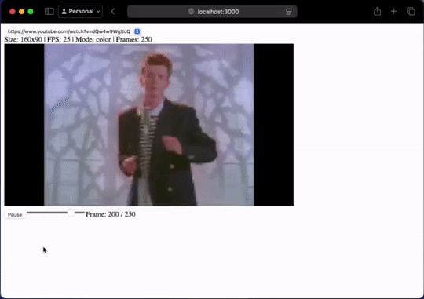
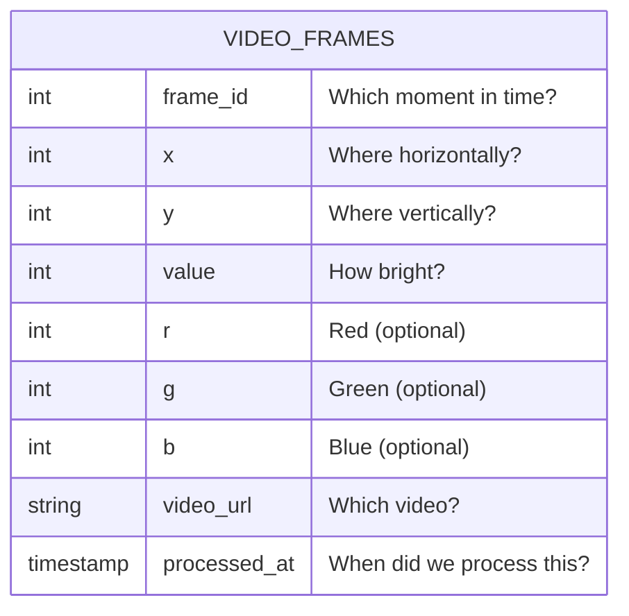

# 🦆 DuckTube: Where Videos Meet SQL

Ever wanted to SELECT * FROM your favorite YouTube video? Now you can! 

DuckTube turns videos into queryable data using the power of DuckDB and WebAssembly. 

Because why watch videos when you can query them? 📺



## 🤔 What's This All About?

You know how people say "a picture is worth a thousand words"? Well, I think a video is worth a million rows in a database! 

DuckTube breaks down videos into their pixel components and stores them in DuckDB, letting you do wild things like:

```sql
-- Find the frame with the most movement
SELECT frame_id, 
       COUNT(*) as pixel_changes,
       'IT MOVED!' as excitement
FROM ducktube.main.video_frames 
WHERE value > 0
GROUP BY frame_id
HAVING pixel_changes > 1000
ORDER BY pixel_changes DESC
LIMIT 1;
```

## 🌟 The Magic Pipeline


## 🚀 Let's Get This Party Started

### 1. Clone & Install (The Basics)

```bash
# Clone like it's hot
git clone https://github.com/patricktrainer/ducktube.git
cd ducktube

# Install all the things!
pip install -e .  # Python stuff
npm install      # JavaScript jamboree

# Set your super secret MotherDuck token
export MOTHERDUCK_TOKEN=your_secret_token_shhh
```

### 2. Process a Video (The Fun Part)

```python
# runner.py example - Turn video into data!
from ducktube import VideoProcessor, MotherDuckUploader

# Step 1: Grab a video
processor = VideoProcessor(
    url="https://www.youtube.com/watch?v=dQw4w9WgXcQ",  # Never gonna give you up!
    width=160,  # Smol
    height=90,  # Very smol
    mode="grayscale"  # Black & white, like the old days
)

# Step 2: Make it rain data!
frames = processor.process()

# Step 3: Send it to the cloud!
uploader = MotherDuckUploader(token="your_secret_token")
uploader.upload(frames)
```

### 3. Query Your Video! (The Really Fun Part)

```sql
-- Find the dancing pixels!
WITH dancing_pixels AS (
    SELECT frame_id, 
           COUNT(*) as moves
    FROM video_frames
    WHERE value > 0
    GROUP BY frame_id
),
rick_stats AS (
    SELECT 
        MIN(moves) as least_dancing,
        MAX(moves) as most_dancing,
        AVG(moves) as avg_dance_energy
    FROM dancing_pixels
)
SELECT 
    CASE 
        WHEN most_dancing > 5000 THEN 'Rick is really rolling!'
        ELSE 'Rickroll intensity: Medium'
    END as dance_analysis
FROM rick_stats;
```

## 🎮 Web Player Features

The web player isn't just a player - it's a time machine for your pixels! 

Built with React and powered by DuckDB's WASM client:

```javascript
// The simplest video player you've ever seen 
// (that's secretly powered by a database)
const DuckPlayer = () => {
  const [currentFrame, setCurrentFrame] = useState(0);
  const [isRocking, setIsRocking] = useState(false);

  const loadFrame = async (frameId) => {
    const pixels = await db.query(`
      SELECT x, y, value
      FROM video_frames
      WHERE frame_id = ${frameId}
      AND video_url = 'never_gonna_give_you_up.mp4'
    `);
    renderPixels(pixels); // Magic happens here! ✨
  };

  return (
    <div className="duck-player">
      <button onClick={() => setIsRocking(!isRocking)}>
        {isRocking ? '🦆 Pause' : '🦆 Play'}
      </button>
      {/* More awesome UI stuff */}
    </div>
  );
};
```

## 🧙‍♂️ The Secret Sauce

The data model is simple yet powerful, like a duck wearing a tuxedo:



## 🎯 Cool Things You Can Build

1. **Motion Tracker 3000**

   ```sql
   -- Find the frame with the sickest dance moves
   SELECT frame_id, COUNT(*) as dance_intensity
   FROM ducktube.main.video_frames
   WHERE value > 0
   GROUP BY frame_id
   ORDER BY dance_intensity DESC
   LIMIT 1;
   ```

2. **Color Party Analytics**

   ```sql
   -- What's the most common color in the video?
   SELECT 
     r, g, b,
     COUNT(*) as frequency,
     'RGB Party!' as celebration
   FROM ducktube.main.video_frames
   WHERE r IS NOT NULL
   GROUP BY r, g, b
   ORDER BY frequency DESC;
   ```

3. **Scene Change Detector**

   ```sql
   -- Find dramatic moments!
   WITH frame_changes AS (
     SELECT 
       frame_id,
       LAG(value) OVER (ORDER BY frame_id) as prev_value,
       value as current_value
     FROM ducktube.main.video_frames
   )
   SELECT frame_id, 
          ABS(current_value - prev_value) as drama_factor
   FROM frame_changes
   WHERE drama_factor > 100
   ORDER BY drama_factor DESC;
   ```

## 🚨 Known Issues

- Sometimes the ducks get tired and need a nap
- Processing Rick Astley videos may cause spontaneous dancing
- Excessive SQL querying may result in pixel fatigue

## 🎮 Try It Yourself

1. Get your MotherDuck token (promise we won't share it with other ducks)
2. Process a video (any video, we don't judge)
3. Query until your heart's content!

```bash
# Quick start (for the impatient)
export MOTHERDUCK_TOKEN=quack
python process_video.py --url "https://youtube.com/watch?v=your_video" --mode grayscale
npm run start  # Fire up the web player!
```

## 🤝 Contributing

Got ideas? We've got queries! Feel free to:

- Add more video processing modes (Pixel art anyone?)
- Implement frame caching (because speed!)
- Create cool visualizations (make those pixels dance!)
- Write more awesome queries (SQL is art!)

## 📝 License

MIT License - Do whatever you want with this code! Just don't forget to give the ducks credit. 🦆

Remember: Keep Calm and Query On! 🦆✨

